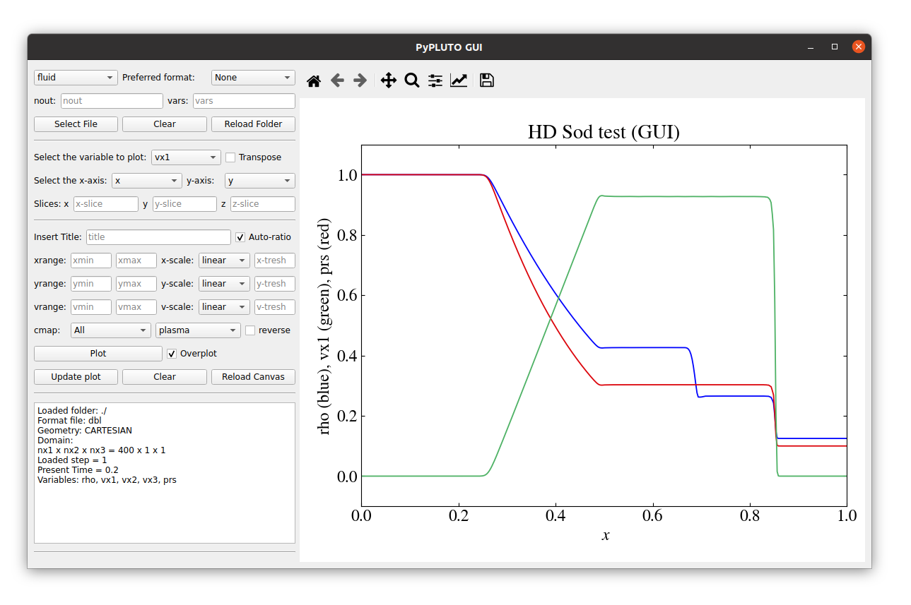

# Summary

In recent years, numerical simulations have become indispensable for addressing complex astrophysical problems. The so-called MagnetoHydroDynamics (MHD) framework represents a key tool for investigating the dynamical evolution of astrophysical plasmas, which are described as a set of partial differential equations [@Chiuderi_Velli_2015] that enforce the conservation of mass, momentum, and energy, along with Maxwell’s equation for the evolution of the electromagnetic fields. Due to the high nonlinearity of the MHD equations (regardless of their specifications, e.g., classical/relativistic or ideal/resistive), a general analytical solution is precluded, making the numerical approach crucial. Numerical simulations usually end up producing large sets of data files and their scientific analysis leans on dedicated software designed for data visualization [@ViSit;@ParaView]. However, in order to encompass all of the code output features, specialized tools focusing on the numerical code may represent a more versatile and built-in tool. Here, we present PyPLUTO, a Python package tailored for efficient loading, manipulation, and visualization of outputs produced with the PLUTO[^1] code [@PLUTO_2007;@PLUTO_2012]. PyPLUTO uses memory mapping to optimize data loading and provides general routines for data manipulation and visualization. PyPLUTO also supports the particle modules of the PLUTO code, enabling users to load and visualize particles (such as cosmic rays [@Mignone2018], Lagrangian [@Vaidya2018], or dust [@MIGNONE2019] particles) from hybrid simulations. A dedicated Graphical User Interface (GUI) simplifies the generation of single-subplot figures, making PyPLUTO a powerful yet user-friendly toolkit for astrophysical data analysis.

[^1]: [https://plutocode.ph.unito.it]

# Statement of Need

The PLUTO code [@PLUTO_2007] is a widely used, freely distributed computational fluid dynamics code designed to solve the classical and (special) relativistic MHD equations in different geometries and spatial dimensions. The original code is written in C (while the upcoming GPU version provides a full C++ rewrite[^2]) and it contains several numerical methods adaptable to different contexts. Data post-processing is a crucial step in analyzing the results of any numerical simulation. Other packages addressing related needs (e.g., [^3]), provide valuable functionality for working with PLUTO data, including loading and visualization. However, they may not support all data formats or offer integration for tasks like data manipulation and advanced plotting.
In this work, we present PyPLUTO v1.0.0, a complete rewrite of the original version [^4]. 
The package retains its core strengths while offering user-friendly methods for generating publication-quality plots with high customization. Despite its enhanced flexibility, PyPLUTO offers strong computational efficiency, enabling the rapid handling of large datasets typical of state-of-the-art numerical simulations. Through this balance between customization, performance, and ease of use, PyPLUTO represents a key tool to effectively communicate scientific results while minimizing the effort required for post-processing.

[^2]: [https://plutocode.ph.unito.it/pluto-gpu.html]
[^3]: [https://github.com/Simske/plutoplot]
[^4]: [https://github.com/coolastro/pyPLUTO]

# Main Features

PyPLUTO is a package written in Python (version $\geq$ 3.10) with the additions of NumPy [@NUMPY2020], Matplotlib [@MATPLOTLIB_2007], SciPy [@SCIPY_2020], pandas [@PANDAS2020], h5py [@H5PY_2013] and PyQT6 [PYQT] (although the last two are optional). The package, which can be installed through pip, is made of mainly 3 classes:

• The `Load` class loads and manipulates the PLUTO output files containing fluid-related quantities.

• The `LoadPart` class loads and manipulates the PLUTO output files containing particle-related quantities.

• The `Image` class produces and handles the graphical windows and the plotting procedures.

Additionally, a separate `PyPLUTOApp` class launches a GUI able to load and plot 1D and 2D data in a single set of axes. PyPLUTO has been implemented to be supported by Windows, MacOS, and Linux, through both standard scripts and more interactive tools (e.g., IPython or Jupyter). The style guidelines follow the PEP8[^5] conventions for Python codes (enforced through the Black package [@Langa2020]) and focus on clarity and code readability.

[^5]: [https://peps.python.org/pep-0008/]

### Loading the Data
The variety of data formats obtainable from the PLUTO code, combined with the high level of output customization, has strongly hindered the development of packages that can consistently load every possible simulation outcome. The PLUTO code provides a variety of output data formats, including raw-binary and h5 (in both double and single precision), VTK, and simple ASCII files (the last ones only for  single-processor 1D and 2D data) for the fluid variables. Some of these formats are also used for particle data files. Additionally, the code also generates descriptor files (*‘.out’*) which contain relevant information regarding the grid structure and fluid variables.

The PyPLUTO package supports the loading of all data formats produced by PLUTO for both fluid and particle variables. The main advantage of the loading strategy is the usage of the memory mapping technique, which allows for the efficient handling of large-size data that exceeds system RAM by enabling lazy loading of data. More specifically, through the memory-mapping loading, the data is directly mapped to memory instead of reading it entirely. This approach becomes convenient when only selected portions of the simulation domain need to be accessed, such as a slice or a zoomed region.

The very first step of the loading procedure consists of ensuring that the data path has been properly defined. If present, the descriptor files are inspected to extract grid variables and other relevant details, such as the names of the fluid variables and how they are stored (e.g., whether all variables are combined in a single file or separated into individual files). Descriptor files are essential for simulations with raw-binary outputs, while they are optional but recommended for VTK and HDF5 outputs as they can enhance the efficiency of the loading process. If the descriptor files are not present, PyPLUTO automatically finds the appropriate files that should be loaded. Finally, the data files are read and the memory-mapped representations of the data are stored as attributes of the `Load` class.

### Manipulating the data
The PLUTO code’s output variables include essential quantities such as fluid pressure, density, velocity, and electromagnetic fields. In certain instances, scientific analysis requires derived or composite quantities, such as plasma magnetization, vorticity, or total mass, which may require a significant amount of computational time. To efficiently handle such calculations, several routines have been included in the `Load` class in order to efficiently manipulate the outcome of a PLUTO simulation.
Here we report some of the most relevant methods and tools present in PyPLUTO concerning data manipulation.

• For non-Cartesian geometries (such as cylindrical or spherical coordinates), the `numpy.meshgrid` method is used to recover a non-uniform Cartesian (and cylindrical in the case of spherical coordinates) grid mesh in order to facilitate the visualization.

• External HDF5 files containing relevant variables can be both loaded and written, either with or without metadata describing the computational domain.

• Fast Fourier Transform (FFT) of a given array is computed through the `fourier` method (present in the Load class and based on `numpy.fft.fftn` and `numpy.fft.rfftfreq`), supporting selective transformation along specific directions. It returns the transformed array and corresponding frequency arrays, facilitating visualization and further analysis.

• Methods for computing key differential operators such as gradients, divergences, and curls, are provided for all coordinate systems supported by PLUTO. Partial derivatives are computed using second-order accurate central differences via the NumPy `numpy.gradient` routine. Geometric factors are applied accordingly to the chosen coordinate system using the geometry information present in the current `Load` object. Users can operate on full datasets or selected slices along constant *x1*, *x2*, and *x3* directions, with outputs dynamically adjusting to the reduced dimensionality.

• Specific routines for extracting field and contour lines are provided within the `Load` class. While these routines require Cartesian coordinates for proper functionality, the user can still apply them to non-Cartesian geometries by calling a routine `reshape_cartesian` that interpolates variables to uniform Cartesian meshes using bilinear interpolation and resampling. Contour lines are computed by taking advantage of the contourpy package[^6]; the contour levels can be specified as an integer (representing the number of levels) or as a list (whose elements are the exact values), with optional color coding. Field lines are computed by solving their corresponding set of ordinary differential equations through the SciPy’s `solve_ivp` method.

• The `spectrum` method is designed to compute histograms of particle variables (e.g., the spectral energy), supporting linear and logarithmic spacing and customizable binning. In addition, the `select` method provides an efficient and flexible way to filter or sort particle indices based on user-defined conditions.

[^6]: [https://github.com/contourpy/contourpy]

### Visualizing the Data
The `Image` class has been implemented to efficiently visualize the data by encompassing some of the most relevant methods present in Matplotlib. Each `Image` class has a 1-1 correspondence with a Matplotlib `Figure` class, which is always a public class attribute. As for the `Load` class, we report some of the most relevant methods and tools present in the `Image` class (thus concerning the visualization of data).

• PyPLUTO allows for complex figures based on multiple customizable subplots through the `create_axes` method. By default, this method serves as a wrapper for Matplotlib’s `add_subplot` routine, allowing for a standard axes grid with fixed rows and columns. For more advanced and customized subplot mosaics, additional parameters provide flexibility in terms of axes boundaries, height and width ratios, and plot spacing.

• The `set_axis` method, which can be applied to every subplot, allows for single-subplot customization (in terms of, e.g., labels, range, scale, and ticks).

• 1D and 2D plots are easily created through the `plot` and `display` methods, which rely, respectively, on the Matplotlib `plot` and `pcolormesh` methods. To avoid combinations of lines not suited for color vision deficiencies, the palette used for the 1D plots is tightly based on [@Tol_2021] with very few modifications[^7]. Particles can also be displayed (as in the [x-point](#xpoint) benchmark) through the `scatter` method, which relies on the homonymous Matplotlib method.

• To ease the creation of customized legends, we have written an extensive `legend` method that can both take the labeled lines from a plot or create a custom legend based on the labels provided by the users.

• A customizable color bar can be created, both attached to an existent 2D plot or placed on a separate axis, through the `colorbar` method.

• A method designed to easily create inset zooms has been implemented for 1D and 2D plots. For 1D plots, the method zooms into a portion of the plot with the lines that lie within. For 2D plots, created through the Maptlotlib `pcolormesh` method, it also allows displaying a different variable in the inset zoom region (see the [disk-planet](#diskplanet) benchmark). Thanks to the flexibility of the Matplotlib `pcolormesh` method, this zooming functionality can be applied in every coordinate system and geometry.

• To easily display fields and contour lines, the Matplotlib `streamplot` and `contour` methods have been included in the `Image` class, with some additional options for the users (e.g., by allowing the definition of a maximum ad minimum field magnitude for computing field lines).

• The analysis of simulation outputs often involves examining the complete time evolution of the obtained solutions. To simplify this process, the `Image` class includes the possibility to interactively visualize the full evolution of a 1D or 2D fluid variable. If multiple time snapshots are loaded via the `Load` class, users can navigate through these snapshots using a slider, eliminating the need to replot variables for each time step.

[^7]: [The palette has been tested for all the color vision deficiencies accessible on https://www.color-blindness.com/coblis-color-blindness-simulator/]

### GUI
The PyPLUTO package includes a GUI (shown in Fig. \ref{fig1}) designed to simplify and enhance the visualization and analysis of simulation data. The GUI is built with PyQt6 and allows users to load and visualize 1D and 2D data (or slices) from PLUTO simulations. The GUI supports real-time updates of loaded data, enabling dynamic visualization as new information becomes available or as existing datasets are modified. Users can adjust axes properties such as range and scale, providing precise control over the visualization. Additionally, color map and color scale adjustments can be made interactively, allowing for immediate feedback and enhanced clarity in data interpretation. The GUI also includes options to clear the canvas and reset the interface, ensuring a clean workspace for subsequent analysis without the need to restart the application. The possibility of saving and further customizing the plots through the interactive Matplotlib toolbar makes the GUI a powerful and flexible tool for both preliminary data analysis and the creation of high-quality publication-ready figures.

# Documentation and Benchmark Examples

Particular efforts in PyPLUTO have been devoted to documentation and test problems. By leveraging the capabilities of the sphinx package [@SPHINX], PyPLUTO features extensive docstrings, serving the dual purpose of creating extensive and consistent documentation and providing a useful reference for future users and developers. The docstrings represent a significant fraction of the package itself, describing all of the features available in both public and private methods present in the package. In addition to documentation, PyPLUTO provides a set of benchmarks immediately accessible after installing the package. These consist of test problems that can be applied to relevant astrophysical applications and showcase the full range of PyPLUTO’s features. Here we report two key examples demonstrating the package’s capabilities.

### Disk-planet Interaction {#diskplanet}
This test simulates the interaction of a planet embedded in a disk [@Mignone_etal_2012] and represents an ideal scenario for understanding the formation and evolution of planetary systems. In particular, the formation of spiral density waves and disk gaps represent some key observational signatures of planet formation and planet-disk interaction [@MelonFuksman2021;@Muley2024a]. In the left panel of Fig. \ref{fig2}, we show an adaptation of Figure 10 of [@Mignone_etal_2012], featuring two separate zoom-ins around the planet’s location.

• The first zoom (top right axis corner) shows an enlarged view of the density distribution using the same color map and logarithmic scale as the global plot;

• The second zoom (top left axis corner) highlights the changes in toroidal velocity due to the presence of the planet by employing a different color map (to enhance the sign change) and a linear color scale.

These zoomed views offer deeper insights into the physical processes at play and demonstrate the utility of PyPLUTO for analyzing complex astrophysical systems.

### Particles Accelerated near an X-point {#xpoint}
This test problem examines particle acceleration near an X-type magnetic reconnection region [@Puzzoni2021]. In the last decades, magnetic reconnection [@Mattia_etal_2023;@Buglietal2024] has proven to be a key physical process to explain the population of non-thermal particles in solar flares, relativistic outflows, and neutron star magnetospheres. This sort of test provides valuable insights into particle acceleration mechanisms in high-energy astrophysical environments by enabling the investigation of particle trajectories and
energy distribution near the X-point.

In the right panel of Fig. \ref{fig2} we show an adaptation of the top panel of Figure 13-14 from [@Mignone2018]. The main plot displays the distribution of test particles, color-coded by their velocity magnitudes, with magnetic field lines overlaid as solid and dashed lines. The inset panel shows the energy spectrum at the initial ($t = 0$, in blue) and final ($t = 100$, in red) time. In this scenario, the absence of a guide field ($\vec{E} \cdot \vec{B} = 0$), results in a symmetric distribution along the y-axis from the combined effects of the gradient, curvature, and $\vec{E} \times \vec{B}$ drifts in the vicinity of the X-point, where the electric field is the strongest.
This plot provides a clear visual representation of particle motion and energy changes, demonstrating how PyPLUTO can be used to investigate complex systems such as particle acceleration in astrophysical sources.

![Left panel: Example of inset zooms of the planet region of the disk-planet test problem. The main plot and the right zoom show the density on a logarithmic scale, while the left zoom highlights the toroidal velocity on a linear scale. Right panel: Example of an X-point region with magnetic field lines overlaid (as contour lines of the vector potential, solid lines). The main plot shows the test-particle distribution, color-coded by velocity magnitudes, while the inset plot displays the particle energy spectrum at the beginning (in blue) and end (in red) of the simulation. \label{fig2}](pyplutotests.png)

# Ongoing research using PyPLUTO

# Conclusion and Future Perspectives

The PyPLUTO package is designed as a powerful yet flexible tool to facilitate the data analysis and visualization of the output from PLUTO simulations, focusing on user-friendliness while allowing the necessary customization to produce publication- quality figures. To overcome current limitations and further enhance the package’s capabilities, particular focus will be devoted to:

• introducing specific routines for rendering 3D data to provide users with tools for visualizing volumetric data;

• supporting interactive visualization and comparison of multiple simulation outputs, allowing the users to track temporal evolution directly with the GUI;

• expanding the graphical interface to support particle data, including the possibility of visualizing particle distributions and trajectories dynamically;

Alongside these improvements, the PyPLUTO development will focus on encompassing the latest features of the PLUTO code, such as new Adaptive Mesh Refinement strategies and extensions to more general metric tensors. PyPLUTO is a public package that can be downloaded alongside the CPU and GPU versions of the PLUTO code[^8]. Regular updates will be released with improvements and bug fixes. Additionally, a repository[^9] containing the PyPLUTO development versions will be available for users who wish to exploit the code’s latest features in advance.

[^8]: [https://gitlab.com/PLUTO-code/gPLUTO]
[^9]: [https://github.com/GiMattia/PyPLUTO]

# Acknowledgments

G. Mattia thanks L. Del Zanna for the valuable discussions on data visualization. The authors thank Simeon Doetsch for their insights on memory mapping techniques and Deniss Stepanovs and Antoine Strugarek for their contribution throughout the years to previous PyPLUTO versions. This project has received funding from the European Union’s Horizon Europe research and innovation programme under the Marie Skłodowska-Curie grant agreement No 101064953 (GR-PLUTO).

# References
